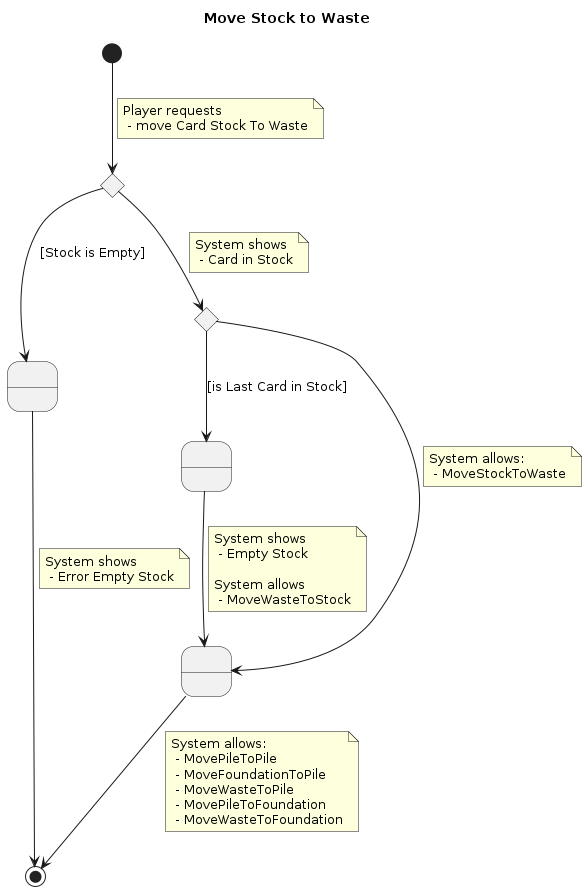

# MDW - Practica 1 - Klondike

Marina Sayols y Álvaro Tango

## Indice

* [Modelo del Dominio](#modelo-del-dominio)
  + [Vocabulario del Klondike](#vocabulario-del-klondike)
  + [Estado inicial](#estado-inicial)
  + [Estado final](#estado-final)
  + [Funcionamiento](#funcionamiento)
  + [Movimiento de Pile a Foundation](#movimiento-de-pile-a-foundation)
  + [Ciclo de Vida de una Carta](#ciclo-de-vida-de-una-carta)
* [Requisitos](#requisitos)
  + [Actores y Casos de Uso](#actores-y-casos-de-uso)
  + [Contexto de Casos de Uso](#contexto-de-casos-de-uso)
  + [Especificaciones](#especificaciones)
  + [Prototipado Interfaces](#prototipado-interfaces)
* [Análisis](#an-lisis)
  + [Análisis de Arquitectura](#an-lisis-de-arquitectura)
  + [Análisis de Casos de Uso](#an-lisis-de-casos-de-uso)

## Modelo del Dominio

### Vocabulario del Klondike

### Estado inicial

### Estado final

### Funcionamiento

### Movimiento de Pile a Foundation

### Ciclo de Vida de una Carta

## Requisitos

### Actores y Casos de Uso

### Contexto de Casos de Uso

### Especificaciones
**Login**

**NewGame**

**MovePileToFoundation**

**MoveToFoundation**

**MoveStockToWaste**

### Prototipado Interfaces
**LoginView**

**GameView**

## Análisis

### Análisis de Arquitectura

### Análisis de Casos de Uso
**Login**

**NewGame**

**MovePileToFoundation**

**MoveToFoundation**

**MoveStockToWaste**
